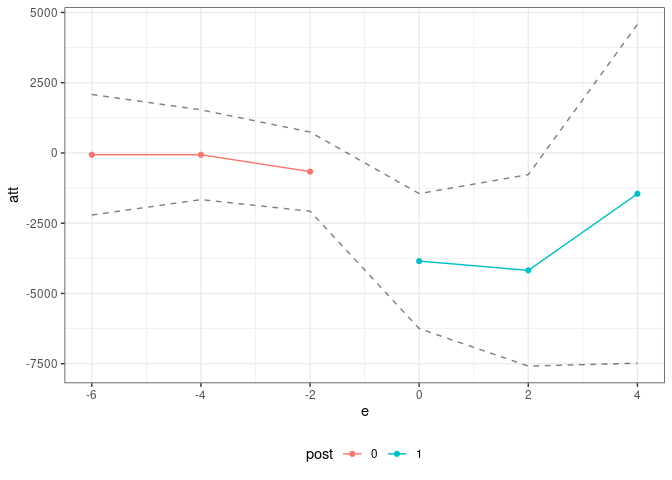
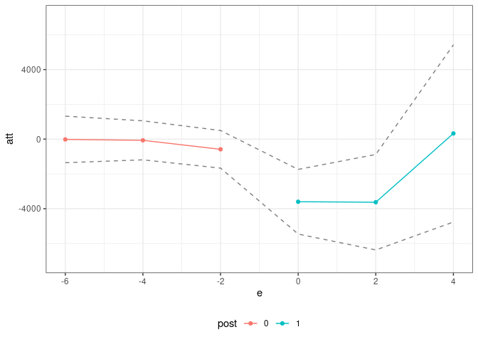

<!-- README.md is generated from README.Rmd. Please edit that file -->

<!-- badges: start -->

<!-- badges: end -->

# Interactive Fixed Effects (ife) Package

The `ife` package contains code to estimate treatment effects in a setup
where a researcher has access to panel data (or, hopefully in the near
future, repeated cross sections data) and where untreated potential
outcomes are generated by an interactive fixed effects model.

The package is not currently available on CRAN, but it can be the
development version of the package can be installed from github by

``` r
# install.packages("devtools")
devtools::install_github("bcallaway11/ife")
```

## Example

Next, we provide a brief example using the application from Callaway and
Karami (2021).

``` r
res <- ife(yname="earn",
           gname="first.displaced",
           tname="year",
           idname="id",
           data=job_displacement_data,
           nife=1,
           xformla=~EDUC + race + gender,
           zformla=~EDUC + race + gender + afqt,
           ret_ife_regs=TRUE,
           anticipation=1,
           cband=FALSE,
           alp=0.10,
           boot_type="multiplier",
           biters=1000,
           cl=10)

summary(res)
#> 
#> Overall ATT:  
#>        ATT    Std. Error     [ 90%  Conf. Int.]  
#>  -3913.851      1182.007  -5858.079   -1969.622 *
#> 
#> 
#> Dynamic Effects:
#>  Event Time   Estimate Std. Error     [90%  Conf. Band]  
#>          -6   -63.8360   856.9402 -1473.377   1345.7051  
#>          -4   -63.4326   736.7646 -1275.303   1148.4374  
#>          -2  -664.5203   592.2105 -1638.620    309.5792  
#>           0 -3848.8739  1026.9530 -5538.061  -2159.6864 *
#>           2 -4179.1319  1523.2116 -6684.592  -1673.6717 *
#>           4 -1454.0791  2721.0421 -5929.795   3021.6368  
#> ---
#> Signif. codes: `*' confidence band does not cover 0
ggpte(res) + ylim(c(-7000,7000))
```



We also have some code for running *individual-specific linear trends
models*. These are a special case of the interactive fixed effects
models that we consider in the paper, but where the factors \(F_t\) are
restricted to be equal to \(t\). We mostly argue *against* these sorts
of models in the paper, but one advantage is that they do not require
any restrictions/assumptions about finding a covariate whose effects do
not change over time.

This code also implements a version of linear trends that is specific to
untreated potential outcomes. Presumably, many of the same criticisms
(and perhaps more actually) in recent papers about implementing DID with
a two-way fixed effects regression likely apply when one includes
individual-specific linear trends in the same sort of specification. The
code we provide here circumvents those issues.

``` r
lt_res <- linear_trends(yname="earn",
                        gname="first.displaced",
                        tname="year",
                        idname="id",
                        data=job_displacement_data,
                        xformla=~EDUC + race + gender,
                        anticipation=1,
                        cband=FALSE,
                        alp=0.10,
                        boot_type="multiplier",
                        biters=1000,
                        cl=10)

summary(lt_res)
#> 
#> Overall ATT:  
#>        ATT    Std. Error     [ 90%  Conf. Int.]  
#>  -3463.467      1239.059  -5501.538   -1425.396 *
#> 
#> 
#> Dynamic Effects:
#>  Event Time   Estimate Std. Error     [90%  Conf. Band]  
#>          -6   -17.6954   818.3984 -1363.841   1328.4503  
#>          -4   -69.4965   712.1606 -1240.897   1101.9034  
#>          -2  -586.0360   644.8390 -1646.702    474.6297  
#>           0 -3599.9237  1191.2933 -5559.427  -1640.4205 *
#>           2 -3628.0465  1704.2076 -6431.218   -824.8745 *
#>           4   326.6318  3146.7251 -4849.270   5502.5340  
#> ---
#> Signif. codes: `*' confidence band does not cover 0
ggpte(lt_res) + ylim(c(-7000,7000))
```


