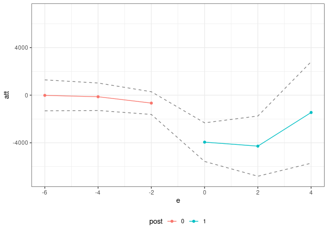

<!-- README.md is generated from README.Rmd. Please edit that file -->
<!-- badges: start -->
<!-- badges: end -->

# Interactive Fixed Effects (ife) Package 

The `ife` package contains code to estimate treatment effects in a setup
where a researcher has access to panel data (or, hopefully in the near
future, repeated cross sections data) and where untreated potential
outcomes are generated by an interactive fixed effects model.

The package is not currently available on CRAN, but the development
version of the package can be installed from github by

``` r
# install.packages("devtools")
devtools::install_github("bcallaway11/ife")
```

## Example

Next, we provide a brief example using the application from Callaway and
Karami (2021).

``` r
res <- ife(yname="earn",
           gname="first.displaced",
           tname="year",
           idname="id",
           data=job_displacement_data,
           nife=1,
           xformla=~EDUC + race + gender,
           zformla=~EDUC + race + gender + afqt,
           ret_ife_regs=TRUE,
           anticipation=1,
           cband=FALSE,
           alp=0.10,
           boot_type="multiplier",
           biters=1000,
           cl=10)

summary(res)
#> 
#> Overall ATT:  
#>        ATT    Std. Error     [ 90%  Conf. Int.]  
#>  -3976.881      1131.198  -5837.537   -2116.225 *
#> 
#> 
#> Dynamic Effects:
#>  Event Time   Estimate Std. Error     [90%  Conf. Band]  
#>          -6   -15.0413   851.3006 -1415.306   1385.2235  
#>          -4  -131.3128   688.5025 -1263.799   1001.1730  
#>          -2  -664.5203   633.7427 -1706.934    377.8937  
#>           0 -3946.5861  1044.2221 -5664.179  -2228.9936 *
#>           2 -4281.1615  1554.6782 -6838.380  -1723.9434 *
#>           4 -1454.0791  2663.9072 -5835.817   2927.6584  
#> ---
#> Signif. codes: `*' confidence band does not cover 0
ggpte(res) + ylim(c(-7000,7000))
```



We also have some code for running *individual-specific linear trends
models*. These are a special case of the interactive fixed effects
models that we consider in the paper, but where the factors $F_t$ are
restricted to be equal to $t$. We mostly argue *against* these sorts of
models in the paper, but one advantage is that they do not require any
restrictions/assumptions about finding a covariate whose effects do not
change over time.

This code also implements a version of linear trends that is specific to
untreated potential outcomes. Presumably, many of the same criticisms
(and perhaps more actually) in recent papers about implementing DID with
a two-way fixed effects regression likely apply when one includes
individual-specific linear trends in the same sort of specification. The
code we provide here circumvents those issues.

``` r
lt_res <- linear_trends(yname="earn",
                        gname="first.displaced",
                        tname="year",
                        idname="id",
                        data=job_displacement_data,
                        xformla=~EDUC + race + gender,
                        anticipation=1,
                        cband=FALSE,
                        alp=0.10,
                        boot_type="multiplier",
                        biters=1000,
                        cl=10)

summary(lt_res)
#> 
#> Overall ATT:  
#>        ATT    Std. Error     [ 90%  Conf. Int.]  
#>  -3463.467      1273.276   -5557.82   -1369.113 *
#> 
#> 
#> Dynamic Effects:
#>  Event Time   Estimate Std. Error     [90%  Conf. Band]  
#>          -6   -17.6954   791.4771 -1319.559   1284.1686  
#>          -4   -69.4965   734.1094 -1276.999   1138.0060  
#>          -2  -586.0360   668.7988 -1686.112    514.0401  
#>           0 -3599.9237  1171.4060 -5526.715  -1673.1322 *
#>           2 -3628.0465  1733.9698 -6480.173   -775.9201 *
#>           4   326.6318  3058.3245 -4703.864   5357.1279  
#> ---
#> Signif. codes: `*' confidence band does not cover 0
ggpte(lt_res) + ylim(c(-7000,7000))
```


